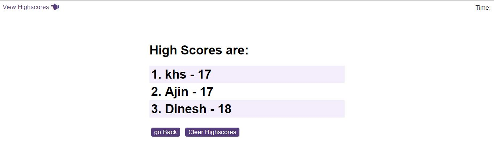
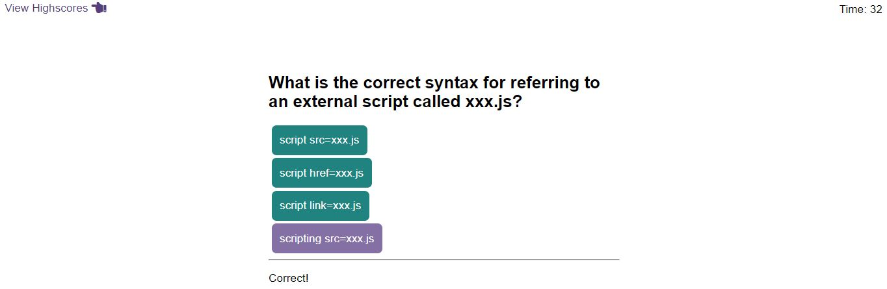
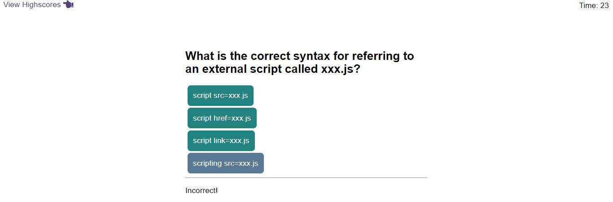
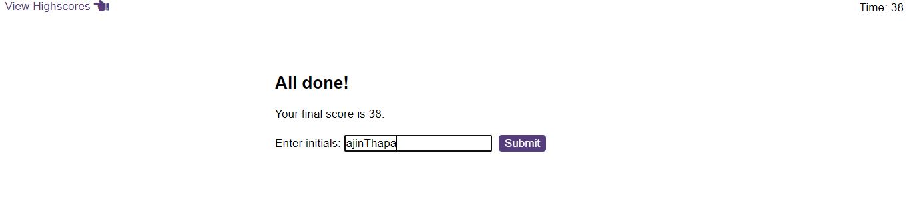

# Play-Time-Quiz
Play time quiz and get high score

# Project Description

A high score scoreboard is kept in local storage as part of an interactive, timed JavaScript quiz.

The following acceptance criteria were followed in developing this product:

GIVEN I'm taking a test on codes.

A timer and a question are displayed once I press the start button.

After I respond to a question, I receive another question.

If I respond wrong to a question, time is deducted from the clock.

The game is over when all questions have been answered or the timer reaches zero.

I can save my initials and score once the game is over.

# Deployed Link:https://ajinthapa2000.github.io/Play-Time-Quiz/ 

# Screenshot

